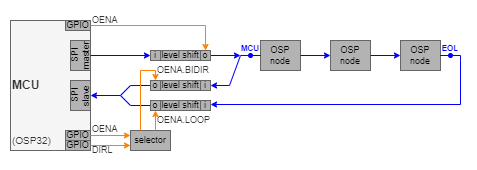
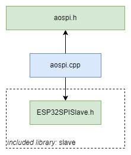
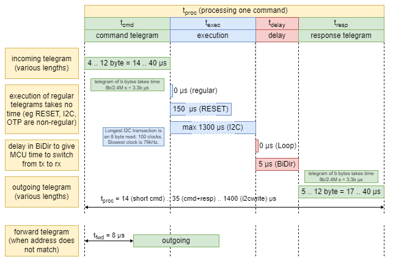
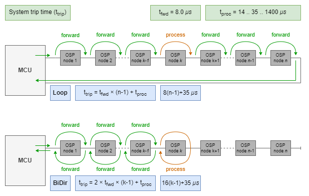
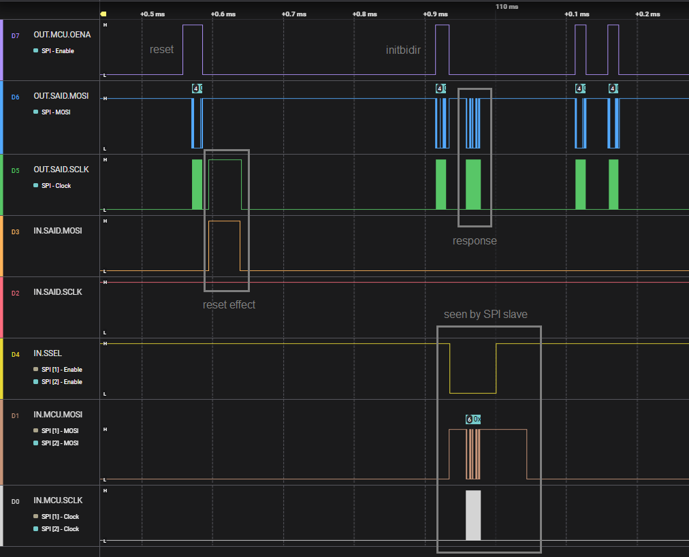
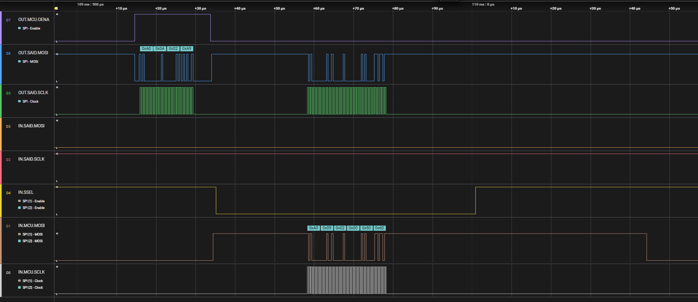
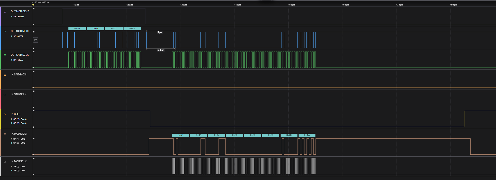
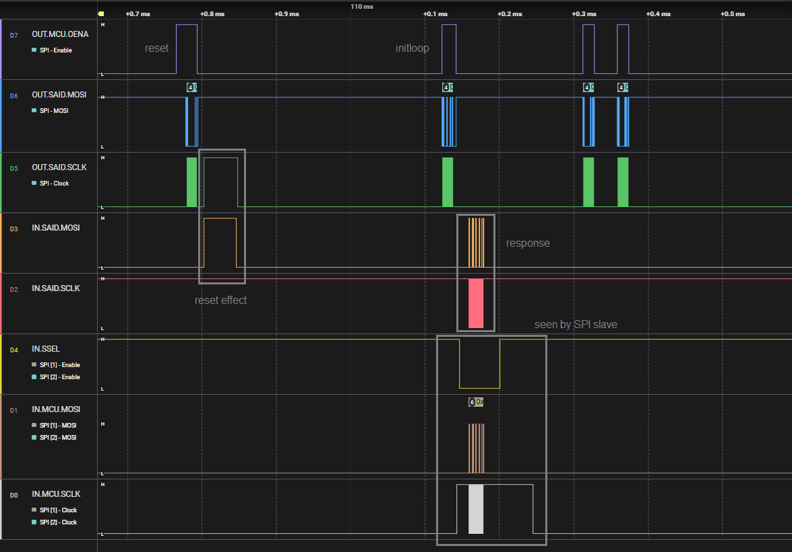

# OSP 2wireSPI aospi

Library "OSP 2wireSPI aospi", usually abbreviated to "aospi",
is one of the **aolibs**; short for Arduino OSP libraries from ams-OSRAM.
This suite implements support for chips that use the Open System Protocol, 
like the AS1163 ("SAID") or the OSIRE E3731i ("RGBi").
The landing page for the _aolibs_ is on 
[GitHub](https://github.com/ams-OSRAM-Group/aotop).


## Introduction

Library _aospi_ implements 2-wire SPI towards and from OSP nodes.


It implements the _communication layer_ between the MCU and OSP nodes;
it allows sending and receiving telegrams (actually, raw byte arrays) using SPI.

Another library - _aoosp_ - implements how the telegrams byte arrays look like: 
the encoding of the arguments into bytes, the CRC, what response telegrams 
comes with which command telegram. It builds on top of _aospi_.


## Examples

This library comes with the following examples.
You can find them in the Arduino IDE via 
File > Examples > OSP 2wireSPI aospi > ...

-  **aospi_tx**  
   In this demo, a small set of telegrams has been hand-constructed.
   Those telegrams are passed directly to the SPI layer (_aospi_ lib).
   The demo uses a minimal amount of telegrams to switch on the LEDs of the first SAID.

-  **aospi_txrx**  
   In this demo, a small set of telegrams has been hand-constructed.
   Those telegrams are passed directly to the SPI layer (_aospi_ lib).
   Some telegrams cause a response which is passed back from _aospi_,
   analyzed and printed.
   
   The demo can be run in BiDir or Loop mode.


## API

The header [aospi.h](src/aospi.h) contains the API of this library.
The header contains little documentation; for that see the
[aospi.cpp](src/aospi.cpp) source file. 

Here is a quick overview:

- `aospi_tx()` sends a command telegram.

- `aospi_txrx()` sends a command telegram and receives the response.

- For statistics, the library keeps track of the number of telegrams sent 
  (with `aospi_tx()` and `aospi_txrx()`) or received (with `aospi_txrx()`).
  These counters can be retrieved with `aospi_txcount_get()` respectively `aospi_rxcount_get()`.
  These counter can be reset to 0 with `aospi_txcount_reset()` and `aospi_rxcount_reset()`.
  
- `aospi_dirmux_set_loop()` and `aospi_dirmux_set_bidir()` set the direction 
  mux to Loop respectively BiDir. 
  This function is typically called once after initialization time, but must be
  called before using `aospi_txrx()` (since that uses the direction mux).
  There are also observers of the current direction mux setting 
  (`aospi_dirmux_is_loop()` and `aospi_dirmux_is_bidir()`).

- `aospi_init()` must be called before using any of the above functions.
  This configures all pins, interrupt routine, SPI master and SPI slave drivers
  and puts the mux to BiDir.

- To test the (OSP32) PCB the following functions are provided. The first pair
  `aospi_outoena_set()`/`aospi_outoena_get()` allows testing the conrol line of 
  the output enable of the outgoing level shifter, the second pair 
  `aospi_inoena_set()`/`aospi_inoena_get()` allows testing the conrol line of 
  the output enable of the incoming level shifter. Do not use during regular
  operation.

- The macro `AOSPI_TELE_MAXSIZE` defines the maximum size of an OSP telegram.

- Finally, there is the macro `AOSPI_VERSION`, which identifies the version of the library.


## Board design

The _aospi_ library assumes presence of certain peripherals and connections.
 
- An ESP32S3 is connected to two SAIDs.

- Level shifters with output enable separate the SAIDs from the ESP.

- A mux is implemented to enable the BiDir or Loop mode (by enabling the associated level shifter).

- Several pull-up and pull-down resistors configure default line levels.

At the moment, the **OSP32** board implements all these assumptions.


### High level schematic diagram

The following diagram sketches the assumed connections.


### Explanation of the schematic

The communication between the ESP and OSP chain involves several lines.

There are three lines (top part of drawing) for mastering command telegrams: 
clock (SCLK), data (MOSI), and enable (OENA).
The SCLK and MOSI are the output lines of the SPI master in the ESP.
The OENA is a GPIO of the ESP, which enables the output of the level shifter
when telegrams are being send over SCLK/MOSI.

> Sending command telegrams (TX) uses the so-called _OUT_ pipe (perspective of the ESP).

There are in total seven lines (bottom part of drawing) for receiving response telegrams: 
clock (SCLK), data (MOSI), enable (ONEA);
and also one to tap clock interrupts (CINT).
Furthermore the SPI slave needs a select line (SSEL), 
and since the OSP node doesn't have that, the ESP generates it (MSEL).
Finally, there is a GPIO line (DIRL) that controls the BiDir or Loop mode -
it controls whether the IN.BIDIR or the IN.LOOP level shifter has its
output enabled (towards the ESP). This implements a direction mux.

> Receiving response telegrams (RX) uses the so-called _IN_ pipe (perspective of the ESP).


### Issues

Some issues controlling OSP nodes deserve above normal attention. 
They are discussed in various sections of this document.

- RESET issue
- missing SSEL issue
- dual master issue
- different modes issue
- fixed clock issue
- mux issue


### Level shifter for sending

On the OSP32 board there is a level shifter between the MCU and the first SAID.
This level shifter has several roles.

- As the name indicates, it shifts the 
  3V3 SPI lines of the MCU to the 
  5V SION and SIOP lines of the first OSP node.
  
- The level shifter, and has an output disable on the OSP side.
  The MCU sets the output always to tri-state (not connected) except while
  sending a telegram. This is important, because in BiDir mode, the first 
  OSP node can also master a response telegram. If this happens at the same moment
  as when the MCU is mastering a command telegram, then two masters would drive
  the lines, giving the possibility of a shortcut. This is referred to as the
  _dual master issue_.
  
- The output disable solves the _RESET issue_.
  When the MCU sends a RESET telegram to the first node, it will also reset its
  comms mode (MCU, EOL, LVDS, CAN). For this the node will look at the line levels
  and these should indicate MCU (high for SIO.P and low SIO.N). 
  
  If not, the OSP node will select another comms mode (e.g. LVDS) and from that moment
  it is no longer possible to send telegrams from the MCU to the OSP node. It is 
  effectively locked, until a power cycle.
  
  The MCU must ensure the correct the N and P line levels after mastering the RESET telegram.
  An easy way to do that is to disconnect the SPI block from the node
  by using the output disable of the level shifter.

The level shifter used on the OSP32 board is unidirectional, but that is not very relevant.

If the MCU has 5V SPI lines, a level shifter is not needed.
However, the second (dual masters) and third bullet (_RESET issue_) still need to be covered.
Both could be covered with a buffer. Another option is to reconfigure the MCU pins after
and SPI transaction, switching them to tri-state.


### Two level shifters for receiving

On the OSP32 board there are _two_ level shifters between the MCU and the OSP chain:
one for the first node (in case of BiDir setup) and one for the last node (in case of Loop setup).
Also these level shifter have several roles.

- As the name indicates, they shift the 
  5V SION and SIOP lines of the first or last OSP node to the
  3V3 SPI lines of the MCU.

- The level shifters have an output disable on the MCU side.
  Their outputs are wired together, but the _selector_ block only enables one of 
  them at a time solving the _mux issue_. The three together implement an input mux under 
  control of the MCU. It selects between BiDir responses (from the first
  OSP node) or Loop responses (from the last OSP node).
  
  

- The MCU sets the outputs always to tri-state (output disable) except while
  receiving a telegram. This helps, in BiDir mode, to not receive the command telegram which is send.
  The MSEL/SSEL also tackles this (although CINT would still cause ISR calls).

- The level shifters are unidirectional. This solves the _RESET issue_ (see above).
  **Warning:** some (bidirectional) level shifters have pull-ups on both sides. 
  If such a shifter were used on the reception side, the _RESET issue_ pops up here 
  as well: when the last node receives a RESET, it would see both SIO lines towards 
  the MCU being pulled up, making the node reconfigure that SIO port to CAN instead of EOL.

- On the OSP32 board, the _selector_ block is implemented with a quad NOR.
  It ensures that at no time both level shifters have their output enabled.

Real-life applications (as opposed to the evaluation kit the OSP32 is) typically
chose either BiDir or Loop but not both. As a result, the _selector_ and one level shifter
can be removed.

On top of that, if the MCU has 5V SPI lines, the (last) level shifter is also not needed.
However, the _RESET issue_ must be solved (but probably having the MOSI and SCLK line as inputs is sufficient).


### No level shifters - 5V MCU

When the MCU is 5V, there is no reason to have level shifters.
However, the RESET issue and  dual master issue still need to be solved.
This could be solved by replacing the OUT level shifter by an external buffer with tri-state output.
If that one is controlled via the OENA line, there is no need to change the library.
The IN (either from BiDir or Loop) is 5V _input_ so no need for a buffer. 

If the IN also needs the MUX (support for both BiDir and Loop), the two IN level shifters 
could be replaced by two external buffers with tri-state output (or some other switch). 
Again, if they are controlled via the OENA.BIDIR and OENA.LOOP lines, there is no need 
to change the library.

It is even possible, if the MCU supports those capabilities, to absorb the tri-stating in the MCU,
by configuring the OUT pads as tri-state instead of setting OUT OENA low. This would require a 
change in the library.

Also the MUX could be implemented by an MCU if it has an internal pin MUX. Also this would require
a change in the software, re-configuring pins when the current firmware changes DIRL.

The diagram below shows the various connection possibilities, upper left (green) the OSP32 board.


The left-most column assumes a 3V3 MCU, and thus uses level shifters.
The three architectures in this column are supported by the aospi lib.

The center column assume a 5V MCU, so no level shifters are needed.
However due to the RESET issue and dual master issue, a buffer with tri-state is needed.
For BiDir and Loop only rows, no mux is needed, so the IN buffers can be avoided in the 
lower two rows.
The three architectures in the center column are supported by the aospi lib.

The right-most column assumes a 5V MCU, so no level shifters are needed.
This column assumes an MCU that can dynamically re-configure its (OUT) pads to tri-state,
and can dynamically re-route (IN) pads to internal peripherals (thus implementing a pin MUX).
The ESP32S3 on the OSP32 board has these features (but it is 3V3).
The three architectures in the right-most column require changes to the aospi lib: 
replacing control of the output enable lines (red) or BiDir/Loop select line (blue) 
with pad-configuration or pad-reroute instructions specific for that MCU.

The two options in the lower right (green) would be typical production board 
implementations (no extraneous components, like on the evaluation board)


## Module architecture

ESP32S3 integrates 4 SPI peripherals. 
SPI0 and SPI1 are used internally to access the ESP32S3's attached flash memory.
This library uses SPI2/HSPI for mastering and SPI3/FSPI for slaving.

The SPI master driver comes with the ESP tool chain.
The SPI slave driver comes from [Hideaki Tai](https://github.com/hideakitai/ESP32SPISlave).
The _aospi_ library comes with a [copy](src/slave) of ESP32SPISlave included, to ensure there
are no version issues. That imported library is actually a single h-file (with code).



The `aospi.cpp` wraps the master and slave driver, with code to handle the 
level shifters, selector, slave select, etc.


## Execution architecture

Sending command telegrams using 2-wire SPI is relatively straightforward
using the standard ESP SPI master driver.

Receiving response telegrams is harder, even with Hideaki Tai's driver.
This is mainly due to the stringent timing requirements.
Most tough scenario is getting a response from the first node in BiDir mode.
The ESP has 5us to switch from mastering to slaving.

This chapter explains the execution architecture in more detail.


### Sending command telegrams

- The MCU sends (command) telegrams to the first node of the OSP chain (SAID OUT on OSP32 board). 
  The MCU typically uses an SPI _master_ block for that.
  
- The first node must always be configured in _MCU mode_ (pull-up on SIO.P and pull-down on SIO.N).

- The communication between MCU and first node is either _1-wire SPI_ or _2-wire SPI_.

  - 1-wire SPI only uses the P wire.
    The signal contains clock and data by using so-called _Manchester_ encoding.
    This means that the MCU firmware must "double" the telegram bits before 
    it passes the telegram to the SPI master block.
    
  - 2-wire SPI uses the P wire for data and the N wire for clock.
    This means that the MCU firmware can just pass the telegram to the SPI master.
    
  - The selection between 1-wire SPI and 2-wire SPI is made by an OTP bit in the SAID
    (bit 0D.3 `SPI_mode`).
    
  - The SAID AS1163 has the OTP bit, the OSIRE RGBi E3731i only supports 1-wire SPI.
  
  - **The _aospi_ library only supports 2-wire SPI**.


### Receiving response telegrams

- The OSP chain sends (response) telegrams back to the MCU.
  The MCU typically uses an SPI _slave_ block for that.
  
- A configuration choice has to be made: 
  either the first or the last node of the chain sends back the responses.
  
  - If the first node is chosen, this is known as bi-directional (_BiDir_) communication.
  
    
    
  - If the last node is chosen, this is known as uni-directional communication or _Loop_.
  
    
    
  - The OSP32 board and this library support both modes.
  
- In either case, the last node must be configured for _EOL mode_
  (pull-down on SIO.P and pull-up on SIO.N).
  
   - In Bidir, a _terminator_ (which has the two resistors) must be attached to the last node.
     Secondly, the first node must be connected to the MCU slave block.
  
   - In Loop, a _wire_ connects the last node to the MCU slave block (SAID IN on OSP32 board)
     and it must be configured for _EOL mode_ (pull-down on SIO.P and pull-up on SIO.N).
  
- On the OSP32 board, the first node is connected to the SPI slave, and the
  last node is connected to the SPI slave, and a mux selects the active connection.
  
  
  

## Implementation notes

- The _aospi_ library is hardwired to use specific pins of the ESP32S3.
  The library could be used with other pins of the ESP32S3, and maybe even with other ESP32xx MCUs. 
  In this case the macros that identify pins (like `#define AOSPI_OUT_SCLK  4`) have to be changed.
  See [aospi.cpp](src/aospi.cpp) for those macros, and refer to the high level schematic diagram.

- To send a command telegram (`aospi_tx()`), the SPI master driver on the ESP is used.
  It follows the Arduino documentation.
  
  ```C++
  spi.beginTransaction(...);
    digitalWrite(SSEL, ACTIVE);
    spi.transferBytes( txbuf, rxbuf, size );
    digitalWrite(SSEL, INACTIVE); 
  spi.endTransaction();
  ```
  
  The _aospi_ implementation (`aospi_tx()`), replaces the SSEL with OENA to 
  enable the output of the level shifter. 
  This is relevant for the _RESET issue_ and the _dual master issue_ (see above).

  One timing requirement that is not free in OSP is on SCLK
  (in plain SPI, the master can vary the clock as long as it is not too fast).
  The clock must be 2.4MHz and no delays are allowed e.g. between bytes (_fixed clock issue_).
  The reason is that OSP has no SSEL, 
  so a dead time of about two clocks signals end-of-frame.
  
  Another timing requirement is on RESET. 
  All commands execute faster than they can be forwarded, 
  so multiple writes cause no problems (ignoring writes that trigger a response).
  There are a couple of exceptions to this rule; one is the RESET command.
  A node forwards the RESET to its successor (in the usual fast way of 7 us),
  but then RESETs itself. This takes 150us, and during that time no
  telegrams should be send to that node.
  
- The SPI slave driver from Hideaki Tai has a non-trivial API 
  especially for the most flexible use "Non-blocking multiple transactions".
  The SPI slave drivers maintains a queue of transactions (byte buffers).
  It is only possible to receive SPI messages when the queue is non-empty.
  This is known as "transactions are in flight". 
  When an SPI message comes in, the driver takes a transaction (buffer) from the queue, 
  and uses that to store the incoming bytes. Then, "the transaction is completed".
  See [driver documentation](https://github.com/hideakitai/ESP32SPISlave?tab=readme-ov-file#non-blocking-multiple-transactions).

- The SPI slave sees response telegrams either from the first node
  (when using BiDir direction), or from the last node (Loop direction).
  Recall that the first node has its SIO configured in MCU mode, with P
  pulled up, and N pulled down. The last node has its SIO configured as
  EOL, with P pulled down, and N pulled up.
  
  This is relevant, because when an OSP node acts a master (for a response), its default clock
  line (N pad) follows this convention. In other words, when an OSP node
  masters in MCU configuration (BiDir), it uses _SPI mode 0_: clock (N pad)
  default **low**. When an OSP node masters in EOL configuration (Loop), it
  uses _SPI mode 3_: clock (N pad) default **high**. This is known as 
  the _different modes issue_. In both cases data is
  captured by the SPI slave in the MCU on the rising clock. The MOSI line
  (P pad) does not have defaults in the SPI protocol.
  
  In OSP context, the SPI block is only receiving data (MOSI) it is
  not sending data (MISO) back to the master (OSP node). Sending would
  happen on the opposite clock edge (falling clock).
  
  Since the slave only needs to receive, it is only triggered by the
  rising edges of the clock. As a result, the _ESP SPI slave driver can
  receive both BiDir and Loop telegrams using both MODE0 or MODE3_.
  
  This is expected to hold for other MCUs as well but has not been checked.

- To receive a response telegram, first a command telegram has to be send (`aospi_txrx()`).
  This function is time critical. It consists of the following steps.
  
  ```
  queue a transaction in the underlying SPI slave driver
  transmit the command telegram (OUT OENA hi, transfer bytes, OUT OENA lo)
  connect ESP to OSP chain (IN OENA hi), enable reception (assert IN SSEL via MSEL)
    wait for response (see below)
  disable reception (deassert IN SSEL) and disconnect ESP (IN OENA lo)
  pick up received bytes from SPI slave driver
  ```  

- Note that a couple of actions need to be taken after sending and before receiving.
  Among that are three GPIO writes (OUT OENA, IN OENA, MSEL).
  In order not to lose time (OSP gives 5 us for the switch over), 
  Arduino's `digitalWrite()` has been replaced with direct SFR (special function register) 
  access (eg `AOSPI_IN_OENA_SET()`).

- Next to the short handover time, there is another issue, the _missing SSEL issue_.
  OSP nodes do not have an outgoing SSEL line, and ESPs cannot work without them 
  (they need them to frame a message to know which byte is the last).
  The OSP32 board has a loop back wire (from MSEL to SSEL).
  Since a response comes as an answer to a command, there is a known moment 
  to assert MSEL.

  However, the SPI slave driver does not have a call-back when it receives bytes.
  If MSEL would de-assert early, the SPI driver would return a transaction 
  (byte buffer) of length 0.
  
  To solve this there is another line, a tap on SCLK to GPIO pin CINT.
  An interrupt service routine attached to that counts clock ticks.
  Since response telegram length is given (max 12 bytes or 96 clock ticks) 
  this tells when to de-assert MSEL once an interrupt for a clock tick has occurred.
  
  The `wait for response` (above) is implemented as follows.
  
  ```
    reset counter that counts clock tick (in ISR)
    wait while counter stays zero but no longer than 17.4ms (timeout)
    wait (response length - counter)/2.4MHz
  ```
  
- This is the timing of one telegram.

  

  This is the resulting timing in a chain.

  
  
- The time out of 17.4 ms used in the code is based on the worst-case chain (longest OSP chain in BiDir)
  and the worst-case command (I2C read of 8 bytes with slowest clock).


## Traces

Two traces from a [logic analyzer](https://www.saleae.com/pages/downloads) 
are available with this documentation.
The high level schematic diagram indicates where the probes of the 
logic analyzer are placed (colored circles).

### BiDir mode

A trace is made, while running `aospi_txrx` in BiDir mode.
The trace is also part of the documentation: [aospi-txrx.bidir.sal](extras/aospi-txrx.bidir.sal).



- The purple pulses (D7, OUT.MCU.OENA) indicates when the OUTlevel shifter is enabled, 
  i.e. when a command telegram is send. The above screenshot shows four: RESET, INITBIDIR, CLRERROR, and GOACTIVE.
- The blue and green lines show data (D5 OUT.SAID.MOSI) and clock (D5 OUT.SAID.SCLK) of the first node.
  See below for a zoom in.
- The orange and red lines show data (D3 IN.SAID.MOSI) and clock (D2 IN.SAID.SCLK) of the last node.
- Observe that after the RESET telegram both the clock of the first and the data of the last node show a pulse.
  This is part of the reset cycle of those nodes, establishing their new comms mode.
- Observer that after the second pulse (INITBIDIR), the first node starts mastering the response.
- The brown and white lines show data (D1 IN.MCU.MOSI) and clock (D0 IN.MCU.SCLK) of the slave block.
- Observe that the slave sees the response.

The figure below shows details of the INITBIDIR command ans response. 



- The BIDIR command telegram being send is sliced by the logic analyzer as A0 04 02 A9; 
  this matches the source code.
- The response telegram is sliced as A0 09 02 00 50 6D, 
  which shows that the last node has address 2 in response to a INITBIDIR.
  

The figure below shows details of the INITBIDIR command ans response. 



- Observe the tight timing (5 us) between command and response.
- The response telegram is sliced as A0 06 07 00 00 00 40 AA, the 00000040 is the type for SAID.
- Observer that the default clock line of the response is **low**.


### Loop mode

A trace is made, while running `aospi_txrx` in Loop mode.
The trace is also part of the documentation: [aospi-txrx.loop.sal](extras/aospi-txrx.loop.sal).



- We see the same pulses after the RESET telegram.
- Observer that after the second pulse (INITLOOP), the last node starts mastering the response.
  We see that on the orange and red lines (D3 IN.SAID.MOSI and D2 IN.SAID.SCLK).
- The brown and white lines show what the SPI slave sees.

The figure below shows details of the INITLOOP command and response. 


- The LOOP command telegram being send is sliced by the logic analyzer as A0 04 03 86; 
  this matches the source code.
- The response telegram is sliced as A0 09 03 00 50 63, 
  which shows that the last node has address 2 in response to a INITBIDIR.

  

- Observer that the default clock line of the response is **high**.


## Version history _aospi_

- **2024 July 7, 0.4.0**  
  - Arduino name changed from `OSP 2-wire SPI - aospi` to `OSP 2wireSPI aospi`.
  - Added link for traces.
  - Added blue slave line in BiDir diagram (`dirbidir.drawio.png`) and green dashed OSP32 border line in OPS32 diagram (`dirosp32.drawio.png`).
  - Renamed dir `extra` to `extras`.
  - Small corrections in readme.md.
  - Added (for board testing) `aospi_outoena_set()`/`aospi_outoena_get()` and `aospi_inoena_set()`/`aospi_inoena_get()`.

- **2024 July 3, 0.3.1**  
  - `license.txt`, `aospi_tx.ino`, `aospi_txrx.ino` line endings changed from LF to CR+LF.

- **2024 July 2, 0.3.0**  
  - Initial release candidate.


(end)
